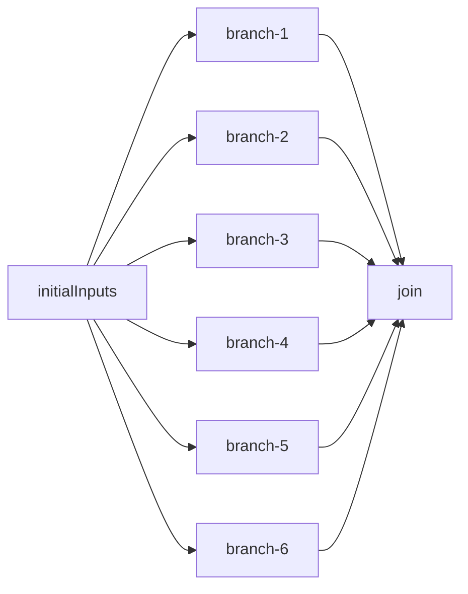
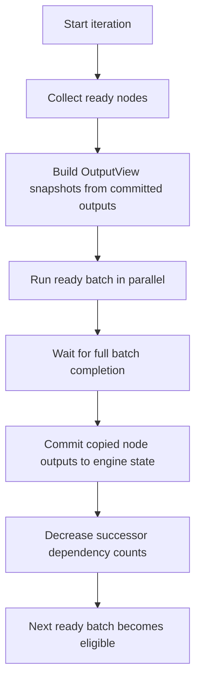
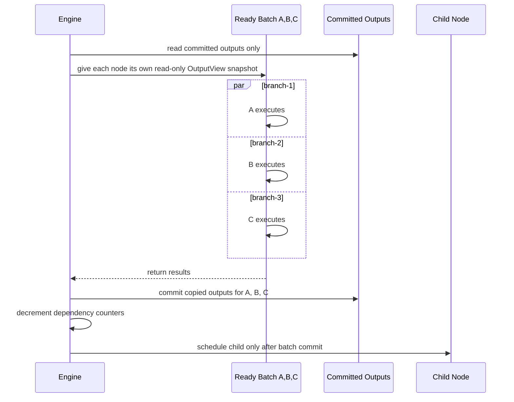

# Parallel Execution Model

This document explains how parallel flow execution works in `echopoint-runner` after the scheduler and `OutputView` changes.

## Core Rule

- Nodes in the same ready batch may run in parallel.
- They can read only outputs that were committed by earlier batches.
- They cannot observe sibling in-flight updates.
- Children run only after the whole parent batch finishes and commits.

## Example Flow



## Scheduler Phases



## Safe Visibility Model



## Why `OutputView` Exists

Before the fix, `ExecutionContext.AllOutputs` was a mutable nested map. That created a correctness risk in parallel execution because a node could accidentally mutate shared engine state.

Now the engine passes a read-only snapshot view instead:

```mermaid
flowchart LR
    S[Engine committed state\nmap[nodeID][outputKey]value] --> O[OutputView snapshot]
    O --> A[Node A]
    O --> B[Node B]
    O --> C[Node C]

    A -. cannot mutate .-> S
    B -. cannot mutate .-> S
    C -. cannot mutate .-> S
```

## Behavioral Guarantees

- Independent siblings do not need to see each other's updates.
- If a node must see another node's output, that relationship must be expressed as a dependency edge.
- Output publication happens after the full batch barrier, not during sibling execution.
- Committed outputs are copied before being stored for future batches.

## Practical Consequence

The engine now behaves like a deterministic DAG executor:

1. run independent work together,
2. commit results together,
3. unlock dependent work after commit,
4. never expose live mutable shared output state to running nodes.
