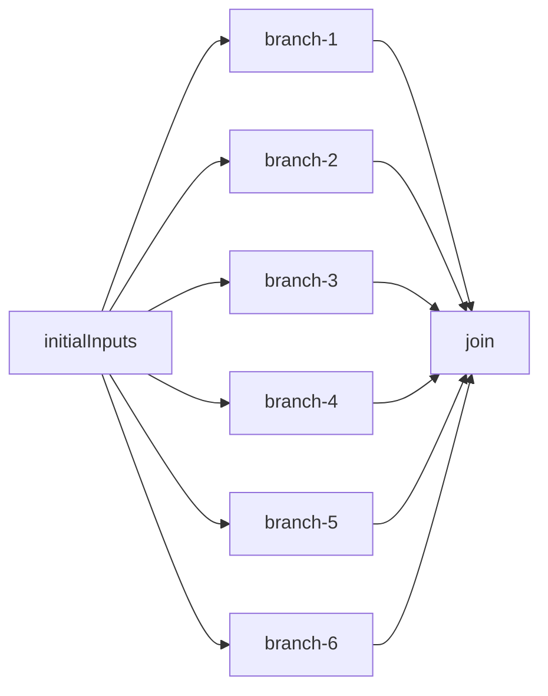
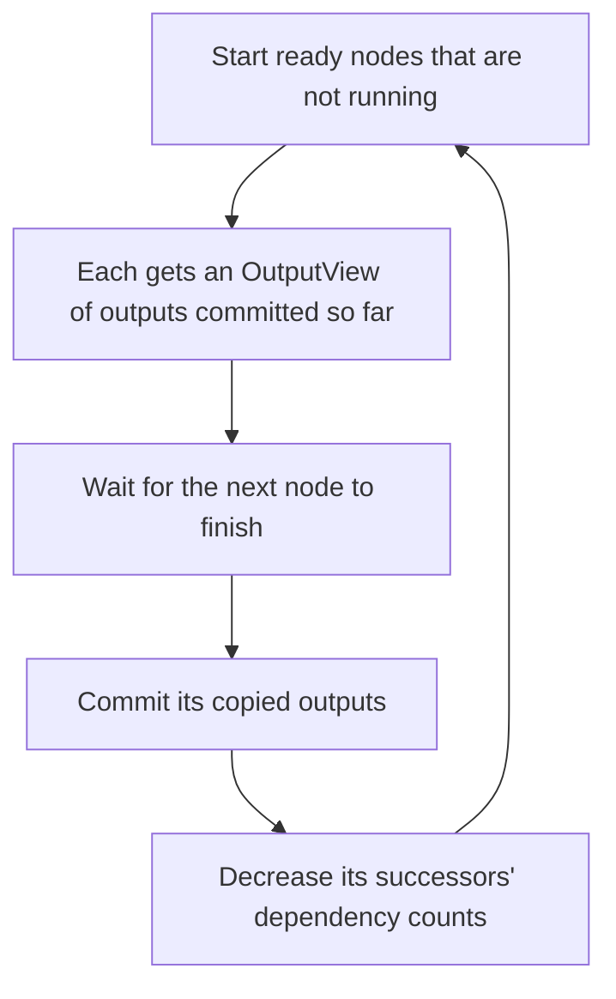

# Parallel Execution Model

This document explains how parallel flow execution works in `echopoint-runner`.

## Core Rule

- A node starts as soon as all of its own predecessors have finished. It never waits for unrelated
  nodes: a slow node (a 20-second `delay`, a long `webhook_wait`) holds only its own successors.
- A node reads the outputs of every node that finished before it started, through a read-only
  `OutputView` snapshot taken when it starts.
- It cannot observe sibling in-flight updates.
- Only the scheduler loop touches the execution state. A node's goroutine runs the node and hands
  its result back; the loop commits the outputs and unlocks the successors.

## Example Flow

```mermaid
graph LR
    I[initialInputs]
    A[branch-1]
    B[branch-2]
    C[branch-3]
    D[branch-4]
    E[branch-5]
    F[branch-6]
    J[join]

    I --> A
    I --> B
    I --> C
    I --> D
    I --> E
    I --> F

    A --> J
    B --> J
    C --> J
    D --> J
    E --> J
    F --> J
```

## Scheduler Loop

```mermaid
flowchart TD
    S[Start ready nodes that are not running] --> V[Each gets an OutputView of outputs committed so far]
    V --> W[Wait for the next node to finish]
    W --> C[Commit its copied outputs]
    C --> D[Decrease its successors' dependency counts]
    D --> S
```

## Safe Visibility Model

```mermaid
sequenceDiagram
    participant Engine
    participant A as Node A (fast)
    participant B as Node B (slow)
    participant State as Committed Outputs
    participant A2 as Child of A

    Engine->>A: start with a snapshot
    Engine->>B: start with a snapshot
    A-->>Engine: result
    Engine->>State: commit A's copied outputs
    Engine->>A2: start now, with a snapshot that includes A
    Note over B: still running; A2 does not wait for it
    B-->>Engine: result
    Engine->>State: commit B's copied outputs
```

## After a Failure

A failure skips only what depends on it. Every on_success node downstream of the failed node is
skipped with `dependency_failed`, naming the step that failed, and the skip cascades through that
subtree. Recording a skipped node always completes its scheduler dependencies,
including during the always phase; there is no separate non-cascading skip mode.
Every other branch keeps starting nodes, so one run reports a verdict for each
independent case. The flow still ends failed.

A node that fails an assertion keeps the outputs its response still yields. An always node that
cleans up, such as `DELETE /widgets/{{create-widget.widgetId}}`, therefore still has the id.

The always phase starts once the main phase is idle. It runs each always node whose inputs exist and
skips the others with the reason that names the missing producer. An on_success node placed after an
always node (for example `delete → verify-gone`) runs in this phase once its own predecessors
succeeded.

`aborted_after_failure` is no longer produced. Executions recorded before this change may still carry
it.

## Why `OutputView` Exists

Before the fix, `ExecutionContext.AllOutputs` was a mutable nested map. That created a correctness risk in parallel execution because a node could accidentally mutate shared engine state.

Now the engine passes a read-only snapshot view instead:

```mermaid
flowchart LR
    S[Engine committed state\nmap[nodeID][outputKey]value] --> O[OutputView snapshot]
    O --> A[Node A]
    O --> B[Node B]
    O --> C[Node C]

    A -. cannot mutate .-> S
    B -. cannot mutate .-> S
    C -. cannot mutate .-> S
```

## Behavioral Guarantees

- Independent siblings do not need to see each other's updates.
- If a node must see another node's output, that relationship must be expressed as a dependency
  edge. Without the edge, whether the output is visible depends on timing.
- A node's outputs are published when it finishes, not at a barrier shared with its siblings.
- Committed outputs are copied before being stored.

## Practical Consequence

The engine behaves like an event-driven DAG executor:

1. start every node whose predecessors have finished,
2. commit each result as it arrives,
3. unlock dependent work immediately,
4. never expose live mutable shared output state to running nodes.
