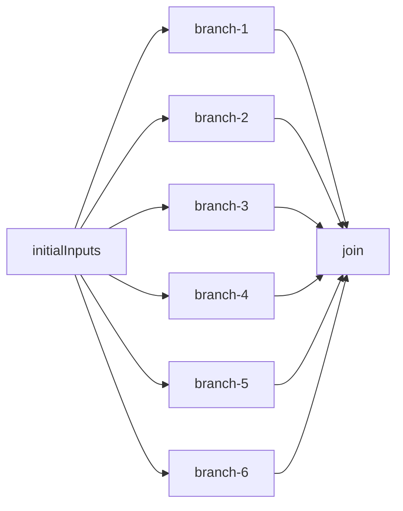
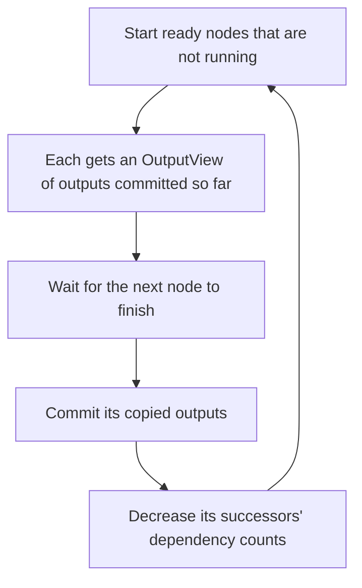

# Parallel Execution Model

This document explains how parallel flow execution works in `echopoint-runner`.

## Core Rule

- A node starts as soon as all of its own predecessors have finished. It never waits for unrelated
  nodes: a slow node (a 20-second `delay`, a long `webhook_wait`) holds only its own successors.
- A node reads the outputs of every node that finished before it started, through a read-only
  `OutputView` snapshot taken when it starts.
- It cannot observe sibling in-flight updates.
- Only the scheduler loop touches the execution state. A node's goroutine runs the node and hands
  its result back; the loop commits the outputs and unlocks the successors.

## Example Flow

```mermaid
graph LR
    I[initialInputs]
    A[branch-1]
    B[branch-2]
    C[branch-3]
    D[branch-4]
    E[branch-5]
    F[branch-6]
    J[join]

    I --> A
    I --> B
    I --> C
    I --> D
    I --> E
    I --> F

    A --> J
    B --> J
    C --> J
    D --> J
    E --> J
    F --> J
```

## Scheduler Loop

```mermaid
flowchart TD
    S[Start ready nodes that are not running] --> V[Each gets an OutputView of outputs committed so far]
    V --> W[Wait for the next node to finish]
    W --> C[Commit its copied outputs]
    C --> D[Decrease its successors' dependency counts]
    D --> S
```

## Safe Visibility Model

```mermaid
sequenceDiagram
    participant Engine
    participant A as Node A (fast)
    participant B as Node B (slow)
    participant State as Committed Outputs
    participant A2 as Child of A

    Engine->>A: start with a snapshot
    Engine->>B: start with a snapshot
    A-->>Engine: result
    Engine->>State: commit A's copied outputs
    Engine->>A2: start now, with a snapshot that includes A
    Note over B: still running; A2 does not wait for it
    B-->>Engine: result
    Engine->>State: commit B's copied outputs
```

## After a Failure

When a node of the main phase fails, the scheduler starts nothing new. Nodes already running finish
and their results are recorded. Every on_success node that never started is skipped
(`aborted_after_failure`, or `dependency_failed` when it needed the failed node's output). The
always phase then runs with the same scheduler.

## Why `OutputView` Exists

Before the fix, `ExecutionContext.AllOutputs` was a mutable nested map. That created a correctness risk in parallel execution because a node could accidentally mutate shared engine state.

Now the engine passes a read-only snapshot view instead:

```mermaid
flowchart LR
    S[Engine committed state\nmap[nodeID][outputKey]value] --> O[OutputView snapshot]
    O --> A[Node A]
    O --> B[Node B]
    O --> C[Node C]

    A -. cannot mutate .-> S
    B -. cannot mutate .-> S
    C -. cannot mutate .-> S
```

## Behavioral Guarantees

- Independent siblings do not need to see each other's updates.
- If a node must see another node's output, that relationship must be expressed as a dependency
  edge. Without the edge, whether the output is visible depends on timing.
- A node's outputs are published when it finishes, not at a barrier shared with its siblings.
- Committed outputs are copied before being stored.

## Practical Consequence

The engine behaves like an event-driven DAG executor:

1. start every node whose predecessors have finished,
2. commit each result as it arrives,
3. unlock dependent work immediately,
4. never expose live mutable shared output state to running nodes.
