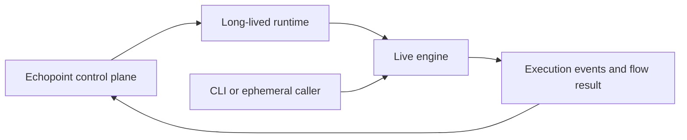

# Implemented architecture

The live engine is in `pkg/engine`, `pkg/node` and `pkg/flow`, supported by `pkg/spi`, `pkg/runner`, `pkg/dynamicvars`, `pkg/executionevents` and `pkg/jobrunner`. These exported packages are consumed by Echopoint, its cloud worker and the CLI. `pkg/core` is a separate, currently unconsumed rewrite; its [README](../../pkg/core/README.md) owns that status.

`cmd/runner` starts a long-lived process by default, with `serve` as its explicit equivalent; `ephemeral` invokes `pkg/ephemeral`. The long-lived path reads [configuration](../../internal/config/config.go), runs `internal/runtime`, and talks to the control plane through `internal/controlplane`. The CLI embeds the execution library rather than starting the runner binary.

The control plane owns API authentication, tenancy and the accepted SSE/progress shape. Exported event/result changes require coordinated consumer contracts and tests. The consumer repository is [Echopoint](https://github.com/nanostack-dev/echopoint), with `cmd/http/openapi.yaml` as its API schema; its source need only be checked out for coordinated contract work.

Event processing is idempotent because delivery may repeat. Node `data` keys use snake_case and match the consumer's `*NodeData` schemas; unknown JSON fields may be silently dropped. Preserve failure/skip reasons, result JSON and progress semantics across API refactors.

The [parallel execution model](../parallel-execution-model.md) owns scheduler/output visibility details, [dynamic template variables](../dynamic-template-variables-reference.md) owns variable semantics, and [ephemeral mode](../ephemeral-mode.md) owns its transport/result contract.

HTTP request and SSE execution carry their private exchange data in named structs,
so result construction uses the same request/response or stream state throughout
the pipeline. These structs are not serialized. Exported execution-result shapes
and JSON keys remain the consumer contract. Failed-result constructors share only
identity, inputs, error pointers and timestamps; each node still chooses its own
error code and message (including request `UserError` handling, SSE's `SSE_FAILED`
code, and poll-specific codes and assertion outcomes).

The engine owns terminal failure logging and chooses severity from `spi.UserError`
with `SafeErrorMessage`, node identity and flow identity. Extractors and SSE result
constructors return failures without repeating that record. Best-effort output
extraction after an assertion failure logs unavailable output names at Debug.
Recovery/fallback, continued-loop, per-event SSE and cancellation diagnostics keep
their own existing policies because those branches handle the outcome locally.
