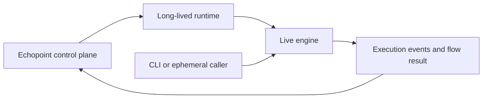

# Implemented architecture

The live engine is in `pkg/engine`, `pkg/node` and `pkg/flow`, supported by `pkg/spi`, `pkg/runner`, `pkg/dynamicvars`, `pkg/executionevents` and `pkg/jobrunner`. These exported packages are consumed by Echopoint, its cloud worker and the CLI. `pkg/core` is a separate, currently unconsumed rewrite; its [README](../../pkg/core/README.md) owns that status.

`cmd/runner` starts a long-lived process by default, with `serve` as its explicit equivalent; `ephemeral` invokes `pkg/ephemeral`. The long-lived path reads [configuration](../../internal/config/config.go), runs `internal/runtime`, and talks to the control plane through `internal/controlplane`. The CLI embeds the execution library rather than starting the runner binary.

The runtime heartbeats every claimed Job. Each Job runs on its own cancellable context; when a heartbeat answers `rejected` (the lease expired or the control plane already failed the execution), the runtime cancels that context, so in-flight HTTP calls and delays abort and later requests are never sent. A rejected Job sends no completion.

```mermaid
flowchart LR
    CP[Echopoint control plane] --> RT[Long-lived runtime]
    RT --> Engine[Live engine]
    Caller[CLI or ephemeral caller] --> Engine
    Engine --> Result[Execution events and flow result]
    Result --> CP
```

The control plane owns API authentication, tenancy and the accepted SSE/progress shape. Exported event/result changes require coordinated consumer contracts and tests. The consumer repository is [Echopoint](https://github.com/nanostack-dev/echopoint), with `cmd/http/openapi.yaml` as its API schema; its source need only be checked out for coordinated contract work.

Event processing is idempotent because delivery may repeat. Node `data` keys use snake_case and match the consumer's `*NodeData` schemas; unknown JSON fields may be silently dropped. Preserve failure/skip reasons, result JSON and progress semantics across API refactors.

The [parallel execution model](../parallel-execution-model.md) owns scheduler/output visibility details, [template references](template-references.md) owns reference and path resolution, [dynamic template variables](../dynamic-template-variables-reference.md) owns generated variable semantics, and [ephemeral mode](../ephemeral-mode.md) owns its transport/result contract.

HTTP request and SSE execution carry their private exchange data in named structs,
so result construction uses the same request/response or stream state throughout
the pipeline. These structs are not serialized. Exported execution-result shapes
and JSON keys remain the consumer contract. Failed-result constructors share only
identity, inputs, error pointers and timestamps; each node still chooses its own
error code and message (including request `UserError` handling, SSE's `SSE_FAILED`
code, and poll-specific codes and assertion outcomes).

The engine owns terminal failure logging and chooses severity from `spi.UserError`
with `SafeErrorMessage`, node identity and flow identity. A failure from the
user's target or a condition they configured is a `UserError` where it is created:
an SSE stream refused (non-2xx) or cut by the target, a poll whose exit condition
never holds or whose `timeout_ms` elapses. A module flow missing from the
referenced flows stays a runner fault, because the control plane refuses to launch
a run whose module flow does not exist. Extractors and SSE result
constructors return failures without repeating that record. Best-effort output
extraction after an assertion failure logs unavailable output names at Debug.
Recovery/fallback, continued-loop, per-event SSE and cancellation diagnostics keep
their own existing policies because those branches handle the outcome locally.

## Control-plane calls

[`internal/controlplane`](../../internal/controlplane/client.go) makes these calls. A self-hosted runner authenticates with `X-Api-Key` and `X-Organization-Id`; a one-shot Job ([`pkg/jobrunner`](../../pkg/jobrunner/jobrunner.go)) uses `X-Job-Token`.

| Call | Purpose | Trace headers |
| --- | --- | --- |
| `POST /runner/jobs/next` | Claim a Job (self-hosted only) | none |
| `POST /runner/jobs/heartbeat` | Renew the leases of every active Job | none: it covers several Jobs |
| `POST /runner/jobs/{id}/events` | Send progress events | the Job's |
| `POST /runner/jobs/{id}/complete` | Report the final status and result | the Job's |
| `GET {webhook.requests_url}` | Webhook wait reads captured requests with `X-Job-Token` | the Job's |

A claim may carry `trace_context`: `{"traceparent": "...", "tracestate": "..."}` (W3C Trace Context). Old control planes omit it. The runner keeps it on the claimed Job (`ClaimedJob.TraceContext`, or `jobrunner.Job.TraceContext` for a caller that claims itself) and sends `traceparent`, plus `tracestate` when non-empty, on that Job's calls above. A `traceparent` that does not match `^[0-9a-f]{2}-[0-9a-f]{32}-[0-9a-f]{16}-[0-9a-f]{2}$` is dropped with its `tracestate`; a `tracestate` longer than 512 bytes or with non-printable bytes is dropped. The runner has no OpenTelemetry SDK or exporter: it runs on customer machines that cannot reach the collector, so it only copies headers. Requests that nodes send to flow target URLs never carry these headers.
